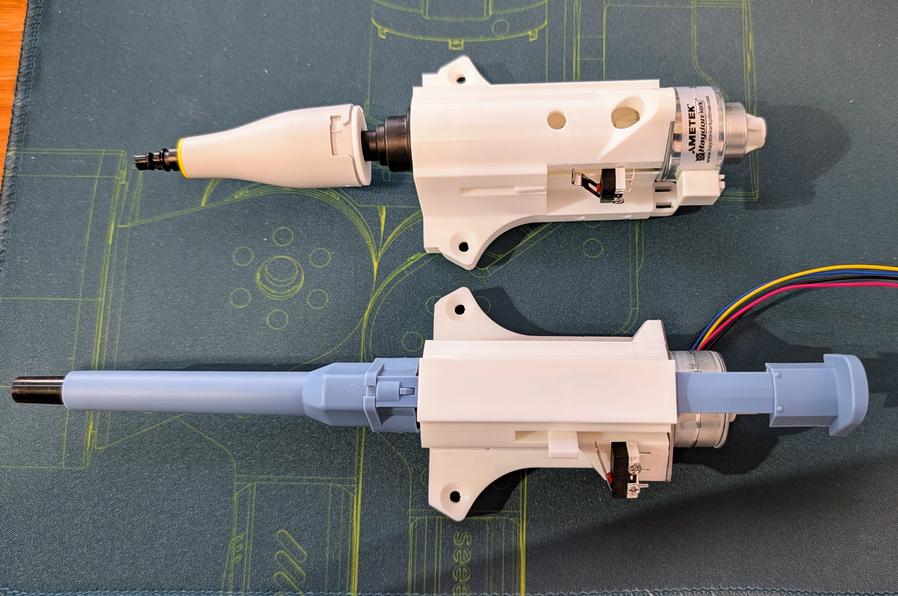
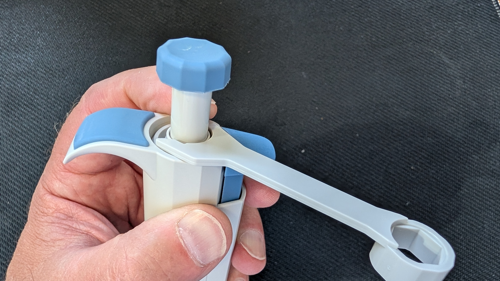
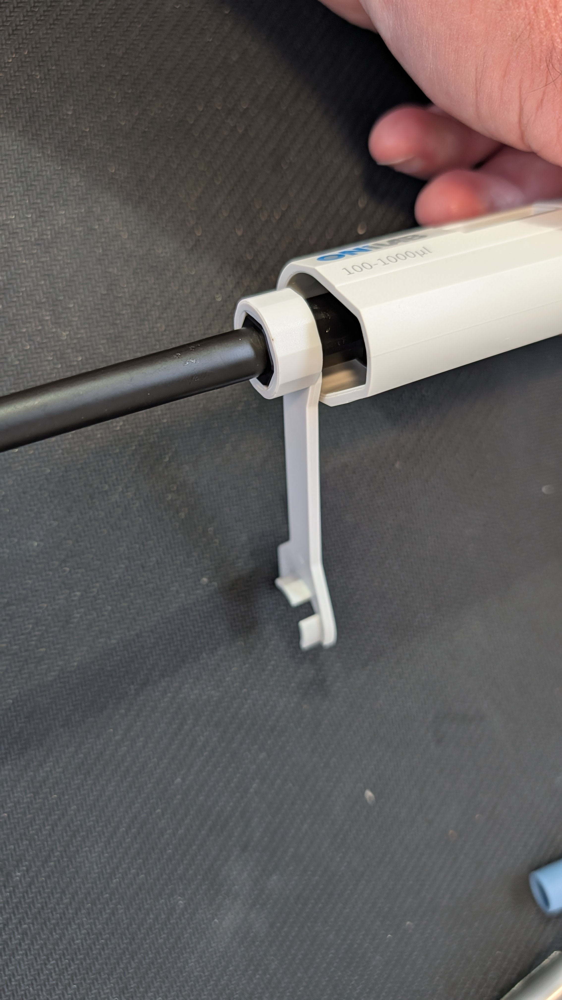
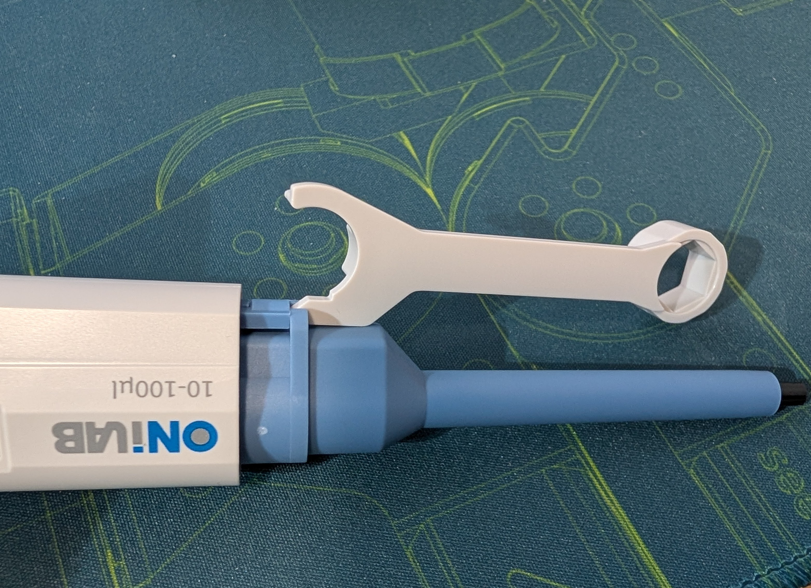
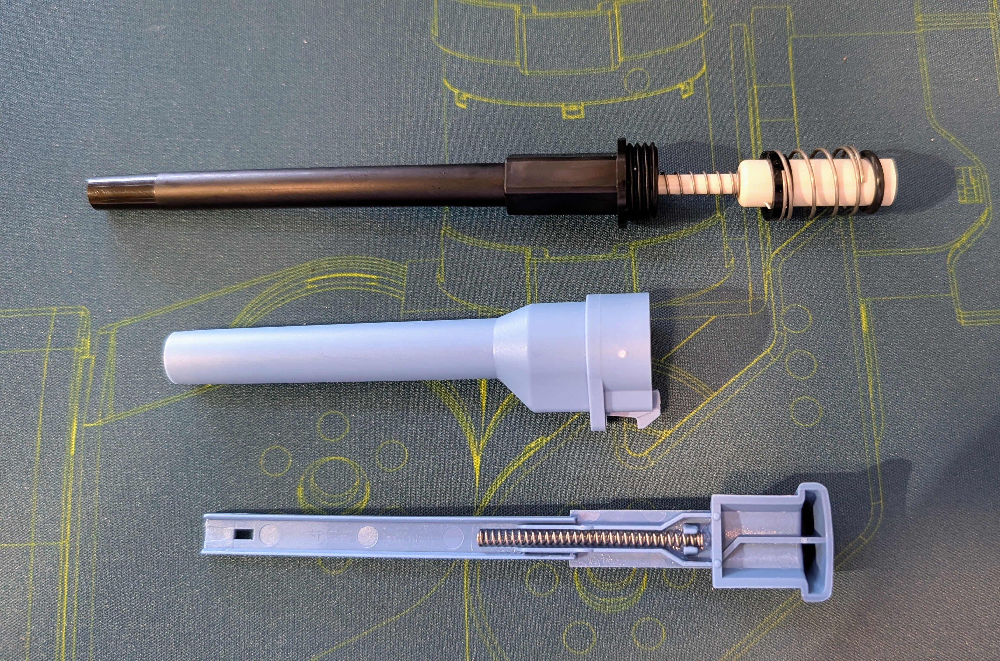
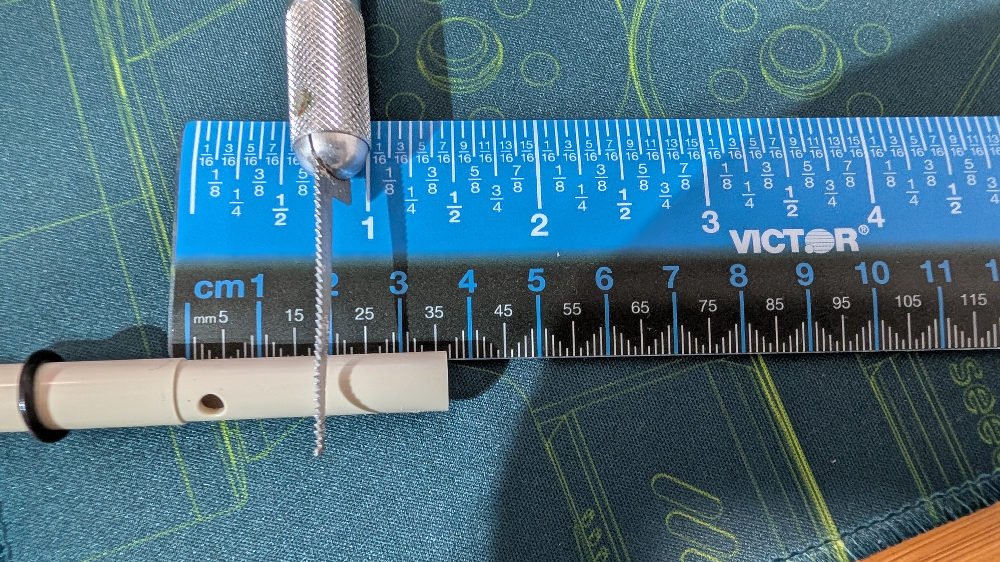
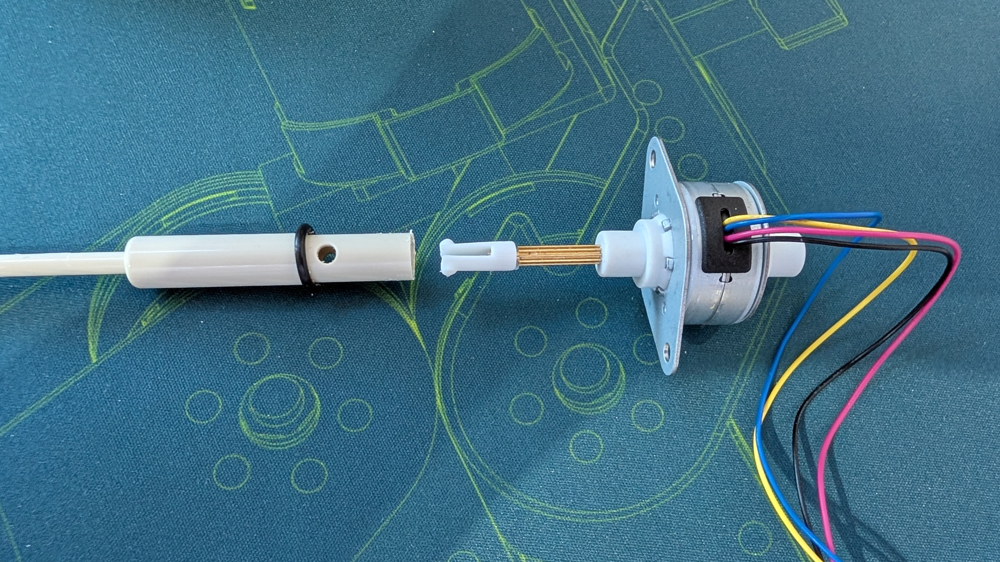

This is a low-cost pipette drive for the Jubilee lab automation frame, with a BOM of less than $40. It's an alternative to [this design](https://github.com/RicktheF22Raptor/jubilee-3D-Automatic-pipette-tool-), which has a BOM of around $300, which annoyed me ;-)

The two are shown side-by-side here. The original design is on top, the cost-down redesign is below

**BOM:**

-- [Linear stepper motor ($14)](https://www.omc-stepperonline.com/25-2x15mm-pm-captive-linear-stepper-motor-0-5a-lead-1-22mm-0-048-travel-13-5mm-25ln48l01-334)

-- [Pipette (any size in the OniLAB line will work - $25)](https://amzn.to/4dsVi8A)

**Instructions**

Use the included tool with the pipette to unscrew the top and bottom as shown here:

Then use a small screwdriver to lift the latch on the tip ejector rod, so you can pull out the tip

You will end up with these parts:

Cut about 15mm off the top of the piston tube as shown here:

Print out the two 3D-printed parts: [body](body.stl) and [connector](connector.stl).

Screw the connector onto the end of the stepper and insert it into the piston tube until it clicks into the holes

Screw the stepper into the holes at top and screw in and insert all the other parts as shown
